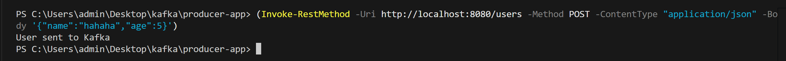
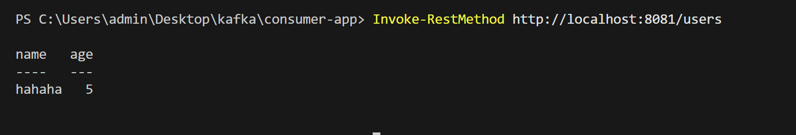

# Ứng dụng Spring Boot Producer - Consumer với Kafka & Docker 

Dự án gồm hai ứng dụng Spring Boot: **Producer**  và **Consumer** , sử dụng **Apache Kafka**  để truyền thông điệp giữa hai bên. Kafka và Zookeeper được triển khai thông qua Docker Compose.

## Yêu cầu hệ thống 

 
- Java 17
 
- Maven
 
- Docker Desktop
 
- PowerShell (nếu kiểm tra API bằng lệnh)


---


##  Hướng dẫn triển khai 


### 1. Cấu hình ứng dụng 

`producer-app/src/main/resources/application.yml`


```yaml
server:
  port: 8080

spring:
  kafka:
    bootstrap-servers: localhost:9092
    producer:
      key-serializer: org.apache.kafka.common.serialization.StringSerializer
      value-serializer: org.apache.kafka.common.serialization.StringSerializer
```

`consumer-app/src/main/resources/application.yml`


```yaml
server:
  port: 8081

spring:
  kafka:
    bootstrap-servers: localhost:9092
    consumer:
      group-id: my-group
      auto-offset-reset: earliest
      key-deserializer: org.apache.kafka.common.serialization.StringDeserializer
      value-deserializer: org.apache.kafka.common.serialization.StringDeserializer
```


---


### 2. Chạy ứng dụng 

 
- Chạy **Producer** :


```bash
cd producer-app
mvn spring-boot:run
```

 
- Chạy **Consumer** :


```bash
cd consumer-app
mvn spring-boot:run
```


---
### 3. Kiểm tra trạng thái cụm Kafka

Xem thông tin chi tiết về Topic và phân phối leader:
```bash
docker-compose exec kafka1 kafka-topics --describe --bootstrap-server kafka1:29092 --topic topic1
```

Kết quả:
```
Topic: topic1   PartitionCount: 3   ReplicationFactor: 3
Partition: 0    Leader: 2    Replicas: 2,3,1    Isr: 2,3,1
Partition: 1    Leader: 3    Replicas: 3,1,2    Isr: 3,1,2
Partition: 2    Leader: 1    Replicas: 1,2,3    Isr: 1,2,3
```

### 4. Kiểm thử khả năng chuyển đổi (Failover)

#### 4.1. Xác định leader hiện tại của một partition:
   ```bash
   docker-compose exec kafka1 kafka-topics --describe --bootstrap-server kafka1:29092 --topic topic1
   ```

#### 4.2. Dừng broker đang làm leader:
   ```bash
   docker-compose stop kafka1  
   ```

#### 4.3. Kiểm tra lại leader mới được bầu:
   ```bash
   docker-compose exec kafka2 kafka-topics --describe --bootstrap-server kafka2:29093 --topic topic1
   ```


### 5. Kết quả


#### 5.1. Gửi thông điệp từ Producer 


 


#### 5.2. Lấy thông điệp từ Consumer 


```powershell
Invoke-RestMethod http://localhost:8081/users
```


#### 5.3. Kết quả 


Thông điệp sẽ được gửi từ Producer → Kafka → Consumer. Kết quả xử lý được hiển thị như sau:

 


